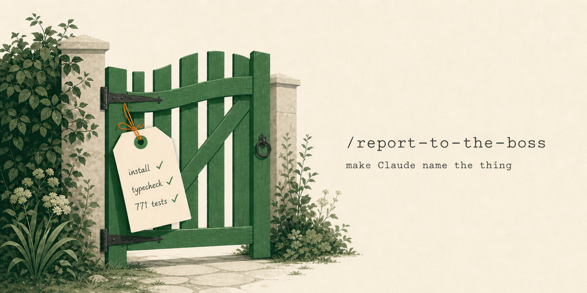

<p align="center">
  <a href="./README.md"></a>
  <a href="./README_CN.md"></a>
</p>

# /report-to-the-boss

A Claude Code skill that makes Claude's reports readable by humans — built from measurement,
not vibes.

> *"Maybe you could tell me what is going on. And please, speak as you might to a young child.
> Or a golden retriever. It wasn't brains that brought me here; I promise you that."*
> — John Tuld, *Margin Call* (2011)

## The problem it targets

Claude writes things like **"the gate is green"** and moves on. Which gate? Which checks?
In a study of 1.25M words of real Claude Code output:

- Claude uses a **metaphorical noun about every 71 words**; human engineers, about every 750.
- When Claude says "gate", **45% of the time the message you're reading doesn't say what the
  gate is** — and a quarter of the time, nothing visible in the session does. The definition
  ran as collapsed tool output, or lives thirty turns back, or in a previous session.
- Claude resolves these references instantly — it holds the whole session in context.
  You don't. Claudish is written for a reader with the author's context window.

The obvious fixes fail measurably. "Be concise" *raised* jargon density in an A/B test
(p=0.042) — density is per-word, and brevity just removes the words that helped you decode.
Banning the top 17 Claudish words worked perfectly and changed nothing: 128% of the removed
volume came back as synonyms from the same metaphor families (*fence* for *guardrail*,
*land* for *gate*).

## What this skill does instead

It never bans a word and never asks for brevity. It sets a stance and one mechanical rule:

- **The stance:** every message is a report to the boss — sharp, out of the room while you
  worked, reading only this message, and treating your plain explanation as the test of
  whether you understand your own work. *"The gate is green" is compatible with not knowing
  which gate. "Install, typecheck, and the 771-test suite all exit zero" is not.*
- **The rule:** use all fifty of the most Claudish words freely — but on first use in a
  message, name the concrete referent within a sentence or two. The test: could the reader
  answer **"which one, exactly?"** from this message alone.

## Install

As a Claude Code plugin (recommended):

```
/plugin marketplace add YuanpingSong/boss-skill
/plugin install report-to-the-boss@boss-skill
```

Or manually, as a bare skill:

```bash
git clone https://github.com/YuanpingSong/boss-skill.git
cp -r boss-skill/skills/report-to-the-boss ~/.claude/skills/
```

Either way, invoke it with `/report-to-the-boss` in any session — or make it standing policy
by referencing it from your `CLAUDE.md`.

## Status: first fork test complete — use as a rewrite pass

The design came from instruction A/Bs showing models obey precise, *named* targets (word lists,
distance rules) and ignore abstract pleas. The first fork test — a real session, its final report
regenerated with the skill on, off, and applied afterward to the finished report — settled how to
use it: **as a delivery-stage rewrite, not an instruction active during the work.** Applied to a
finished report, it kept every figure and anchored them — and writing two of those anchors exposed
real vagueness the author hadn't noticed in their own text. Active from the start, it instead
induced exactly the avoidance it disclaims: the model quietly swapped listed words for unlisted
synonyms. Which is faithful to the scene the skill is named for — Tuld asks for the golden-retriever
version only after Sullivan's analysis is done. More fork before/afters to come.

## The full study

The blog post — with the measurements above, the methodology, and the **50-word dictionary of
Claudish** this skill's trigger list comes from:

**[The Gate Is Green](https://songyp.com/blog/the-gate-is-green)** · [中文版](https://songyp.com/zh/blog/the-gate-is-green)

## License

MIT
